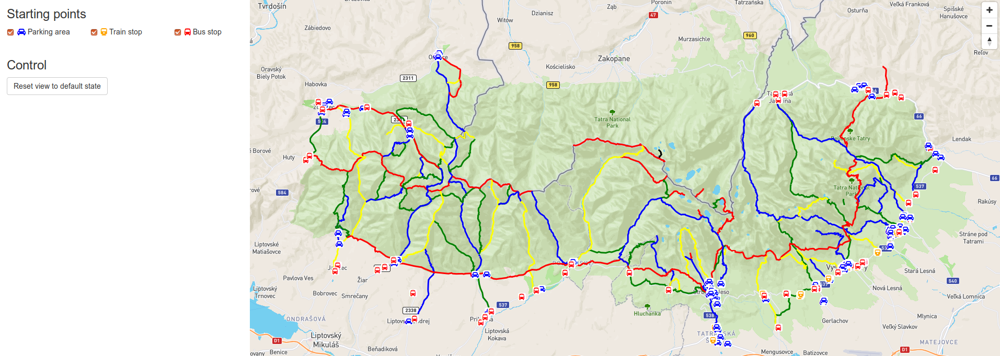
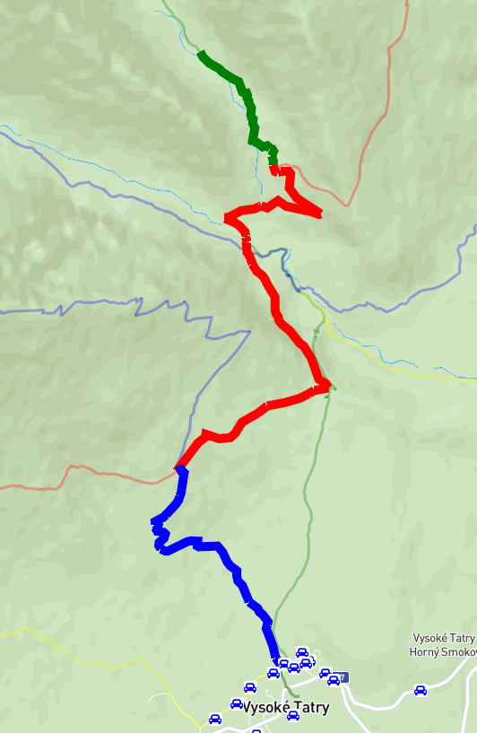
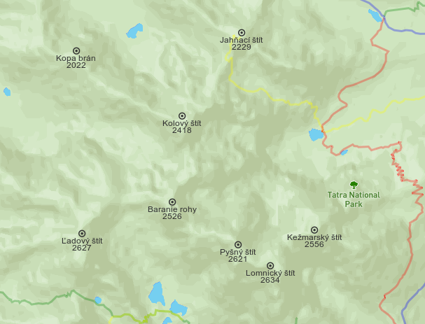
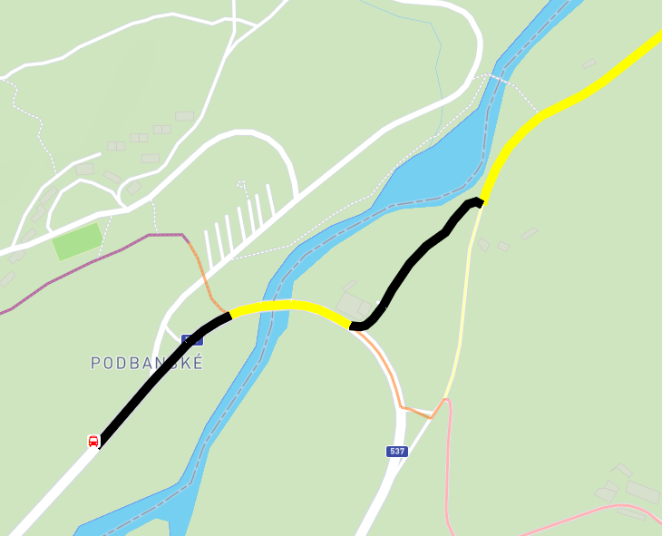

#Popis
Aplikácia slúži ako plánovač výletov do Vysoých Tatier. Pomocou aplikácie je možné zobrazovať všetky značené chodníky v Tatrách, zobrazovať ich trasu a farbu, a tiež vyhľadávať trasy, pomocou ktorých sa dostaneme čo možno najbližšie k požadovanému miestu na mape (Tatrách sa môže chodiť iba po vyznačených chodníkoch). Nájdená trasa zároveň začína v tzv. začiatočnom bode, čo môže byť pakrovisko, autobusová zatrávka alebo zastávka električky. Je možné vybrať iba niektoré z týchto začiatočných bodov a aplikácia na zmeny okamžite zareaguje a nájde novú najkratšiu trasu. Vybraná trasa začína na najbližšej ceste pri začiatočnom bode a končí na mieste, ktoré je od zvoleného bodu na mape vzdialené najmenšiu vzdialenosť.

Od určitej úrovne priblíženia sa na mape zobrazujú aj niektoré vrcholy, ktorée slúžia na zlepšenie orientácie na mape. Po výbere bodu na mape sa pôvodné značené chodníky zpriesvitnejú a zvýrazní sa vypočítaná trasa. Celý pohľad je možné resetovať do pôvodného zobrazenia pomocou tlačidla v ľavom menu (Nastaví sa poloha, zoom a zobrazia sa všetky značené chodníky).

Pri vybranej trase sa optimalizuje počet použitých farieb na čo najmenší počet tak, aby si návštevník v prípade duálneho značenia neiktorých častí (napríklad súčasne žltá a modrá fara) nemusel pamätať všetky zmeny farieb ale zostal jednej farbe čo možno najdlhšie. 

Po výbere trasy sa v ľevom okne zobrazuje analýza trasy. Konkrétne v akom prostredí bude návštevník kráčať akú vzdialenosť. Prostredia sú napríklad les, lúka alebo skaly.

Ukážky:

1. Východzí pohľad na aplikáciu

2. Ukážka navigácie

3. Ukážka zobrazenia štítov pri dostatočnom zoom-e

4. Ukážka navigácie ku začiatočnému bodu - autobusovej zastávke

#FrontEnd
FrontEnd využíva Angular 6 a NPM balík pre mapbox. Aplikácia pozostáva z 2 komponentov. App (defaultny komponent angularu), ktorý obsahuje ľavú časť obrazovky s filtrom a zobrazovaním nejakých údajov. Druhým komponentom je mapa, ktorý zabezpečuje zobrazovanie výsledkov a interakciu používateľa.

#BackEnd
BackEnd je postavený na Node a express.js a jeho hlavnou úlohou je spracovanie požiadaviek z FE, vykonanie dopytov na databázu a vrátenie výsledkov na FE.

#Dáta
Všetky dáta pochádzajú z OpenStreetMap. Sťahovaná veľkosť datasetu bola necelch 200 MB (súbor `data_tatry.osm`). Dáta boli predspracovaná pomocou SQL scriptu `sqls/initialization.sql` pričom vytvorili viacero pomocných tabuliek, topológiu pre pg_routing a navigačné funkcie.

#API
Jednoduché endpointy sú
`GET /api/v1/trails` - Zoznam chodníkov, ich farieb a trás
`GET /api/v1/starting_points` - Zoznam začiatočných bodov, vrátane ich typu
`GET /api/v1/dominant_peaks` - Zoznam vrcholov s ich názvom a výškou

Zložitejšie endpointy sú
`GET /api/v1/route_to_nearest_starting_point/<lon>/<lat>` - Nájde najbližšiu cestu k bodu vyjadrenom pomocou *lon* a *lat*. Od tiaľ nájde najkratšiu cestu k začiatočnému bodu
`GET /api/v1/route_analysis/<lon>/<lat>` - Vykoná analýzu trasy k zvolenému bodu vyjadrenom pomocou *lon* a *lat*

Za obe zložitejšie metódy je možné pridať pole typov začiatočných bodv, ktoré má endpoint brať do úvahy. Napríklad ak chcem brať do úvahy všetky typy začiatočných bodov,použijem :
`?activeStartingPoints[]=parking&activeStartingPoints[]=bus&activeStartingPoints[]=train`